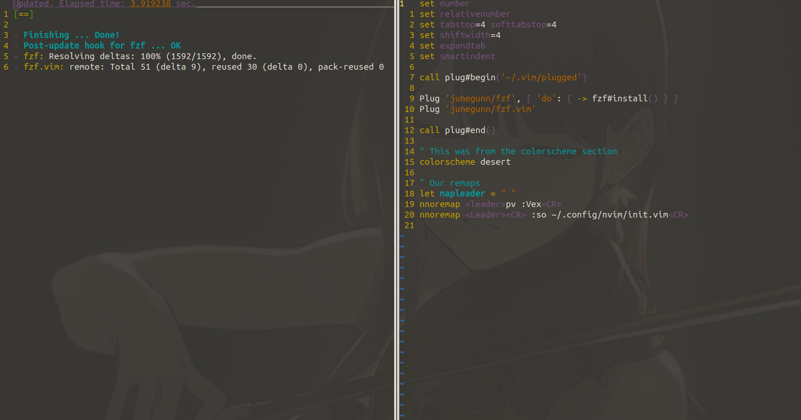
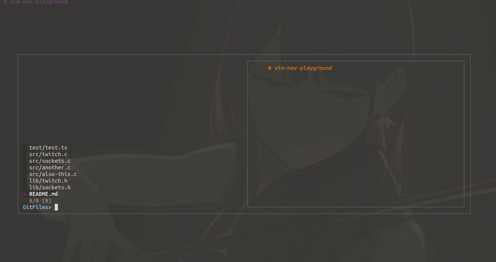

Plugins!

Yes vim does get better.

Yes, that not so pretty language VimL is a primary vehicle in making things
nice.  In NeoVim you can use Lua, which is quite nice.  Especially when you
consider that there is a Typescript -> lua converter.  Which means you can use
a typed language and get type completion and create vim plugins.  42069IQ

### Get a Plugin Manager
Plug!

Lets follow the instructions together getting
[Plug](https://github.com/junegunn/vim-plug) vim plugin manager installed


```
... plays waiting music ...
```

### File Navigation 2.0
Let's add a fuzzy finder, remap some things, and make it work for us.  We are
going to use FZF even though I Use telescope personally.  The reason for this
is because Telescope is neovim specific (lua) and wont work with Vim.  Where as
FZF has been working for some time with vim.

Lets add the following lines to your vimrc

```viml
call plug#begin('~/.vim/plugged')

Plug 'junegunn/fzf', { 'do': { -> fzf#install() } }
Plug 'junegunn/fzf.vim'

call plug#end()
```

Our vimrc should look something like the following.

```viml
FILL ME IN LATER
```

Lets source our vimrc

```viml
:so %
```

Now we need to execute our plugin manager.

```viml
:PlugInstall
```

### WARNING
### My Vim Colorscheme is just a default one, its ugly

Once you do this you should see the following menu



Now we can execute `:GFiles`, lets give it a try in `vim-nav-playground`.



### WHAT HAVE I TAUGHT YOU?
What should we do now?

* M A K E _ A _ R E M A P

```viml
nnoremap <C-p> :GFiles<CR>
```

### Recap
* We got a plugin manager that makes installing plugins easy!  You just need
  the path on github to install new ones.

* We installed FZF, made a remap! then showed how awesome it is.

