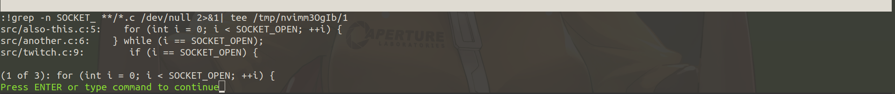

Quickfix lists were very mysterious to me when I started with vim.  I knew that
there was a list of items and that it would pop up and if I left them I didn't
know how to go back.  Little did I know how useful they are, especially when
navigating histories, such as git.

Lets create a quick quickfix

open up vim in the root of `vim-nav-playground`

```bash
vim .
```

now execute

```viml
:grep SOCKET_OPEN **/*.(c\|h)
```

You should see something like this:



Once you press `<CR>` you will see that the results disappear and you are
navigated to the first result.  What should you do?  The proper answer is
consult the `:h quickfix` page, but since I am here, let me walk you through
some actions.

When dealing with a quickfix you need 3 commands primarily, `:copen`, `:cnext`,
and `:cprev`.  Lets try `:copen` first.  Once you have executed it you should
see the following.


Lets select the other option.  This will cause the above buffer to navigate and
the quickfix list will remain open.  Oh no, how do we get back to the quickfix
list?

you could navigate back by executing a copen
```viml
:copen
```

you could force navigate back by closing the current window.  There is nothing
left but going back to the remaining buffer that is open.
```viml
:q
```

You can window navigate.  You can start a window navigation by pressing
`<C-w>`.  What do you think you should press next to navigate towards the
quickfix menu?

If you said `j` you are awesome.  YES!  Use your vim movements you already
know!  Don't you love when things come full circle!

Anywho, so you can guess you can move betwixt splits by press `<C-w>` and `h`,
`j`, `k`, or `l`.  This is great, but it kind of sucks.


### WHAT DO WE DO NOW???
If I have to say make a remap one more time.

```viml
" I don't know if I love these remaps yet.  I am considering doing
" <leader>c(k|j|o)
nnoremap <C-k> :cnext<CR>
nnoremap <C-j> :cprev<CR>
nnoremap <C-E> :copen<CR>
```

### No Internet ordering problem
When practicing this presentation I kept finding myself having a problem.  I didn't want to have to keep compiling and using `npm run dev`.  But I wanted to practice through my presentation in order.  For the most part I just dealt with it and booted everything up.  But on the flight here I was unable to load the pages due to internet requirements.  But!!! I could solve the ordering issue via qflist.

#### getqflist and setqflist


