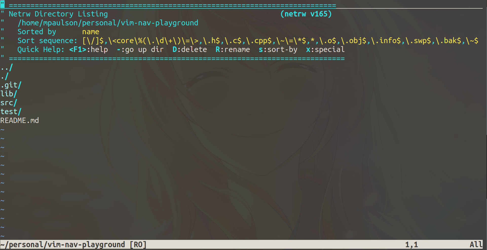

As you imagined there is the "Vim" way to do everything.  But the good news is
that there are many a plugin to make this process easier.  Lets start off by
learning the vim way.

First, lets clone a small test repo

ssh
```bash
git clone git@github.com:ThePrimeagen/vim-nav-playground.git
```

https
```bash
git clone https://github.com/ThePrimeagen/vim-nav-playground.git
```

navigate to `vim-nav-playground` and open up vim by opening up the directory in
vim.

```bash
cd vim-nav-playground
vim .
```

This should be what you are seeing (bar the colorscheme)


