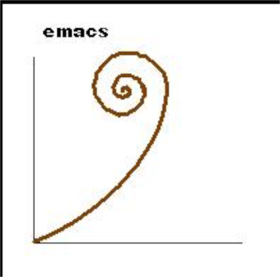
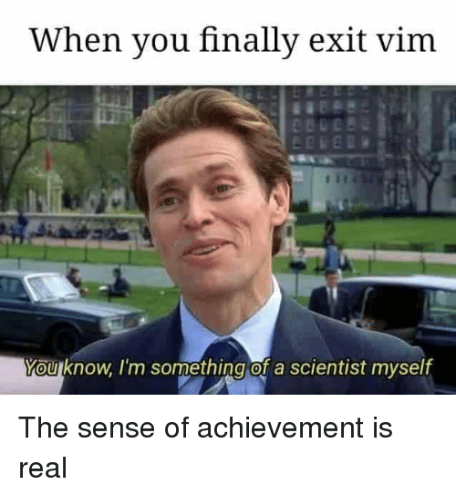

### Motivation

Often its the little choices in our lives.

### Welcome to Vim

#### But first, lets meet ED

```bash
> ed my-file.ts
```

You probably feel lost, press q to get the heck out of there.  (on FEM I do
some actual editing)

Lets do it once more, but with ex

```bash
ex my-file.ts
```

ex is the improved version of ed.  It also comes with Bill Joy's vi mode.  Go
ahead, type `vi<enter>`.  Welcome to vi!  The predecessor of vim.  :q to get
out.

Some fun facts about vi mode in ex.

* Was originally written by a single person, Bill Joy, in 1976.
* Ram was < 1k
* Emacs cost $100s.  Yikes



* hjkl are movement keys because of Bill Joy's keyboard, which apparently was
  the only ever made...


* Bill Joy's words of wisdom
  * "People don't know that vi was written for a world that doesn't exist anymore"
* vi was written to edit text with a 300 buad modem.

## Why do I use vim?

I think I am a lot like you.  I used netbeans.  I was just a regular student
doing regular java binary searches in Netbeans.

One time I opened up vim at the encouragement of my friend...



I saw someone at some point
use vim/emacs and it blew my mind.  I wanted to be good the command line.  I
wanted to be fast.  I wanted to be covered in that sweet organic, grass fed,
free range coconut oil!

So I took the journey.  I started in IntelliJ with ideaVim!  It was painful.  I
am not going to lie, I almost gave up after one hour and I accomplished nothing
but being frustrated.


But then I decided that I was going to master the simple
movements and start mastering each movement one at a time until I was the best
there was.

Lets get started on this journey together.  Lets get vimmed out of our mind.
By the end of this course, hopefully you will understand what in the world
coconut oil has to do with vim.

Personal note.  The love of the thing and Dante.

## Set Expectations
You may feel confused, so ask questions.

## Who Am I?
* I make youtube videos about Vim
* I stream on twitch 
    * NeoVim Plugins
    * Vim Deathmatch.  A battle royale like vim plugin to battle for fastest
      vim editing skallz (lua + docker)
    * Sonic Pi.  Creating live beats with the help of chat. (python + ncurses + docker)
    * Coding for Netflix (typescript)

* I work at Netflix

## Who should take this course
* A (want to be) developer
* Desire to be excellent and to learn
* You wish to defeat complacency

## Prereqs
* Unix System as I cannot help you if you are on windows and you experience and
  problems.  I suggest Plebuntu
* typing skills will directly affect your experience.
* `git clone https://github.com/ThePrimeagen/vim-nav-playground.git`

## Flavors of vim
* VIM - Vi IMproved
    * 8.1+

* NeoVim (I personally use this, wont go over anything neovim specific)

* spacevim
    * https://spacevim.org/

* onivim2
    * https://onivim.io/

## Learning Vim
* vimtutor
* vim-adventures
* [ThePrimeagen](https://youtube.com/ThePrimeagen)'s Youtube
  * 6 part series
  * Learning lua plugin dev
  * VimRC
* `:h usr<tab>`


